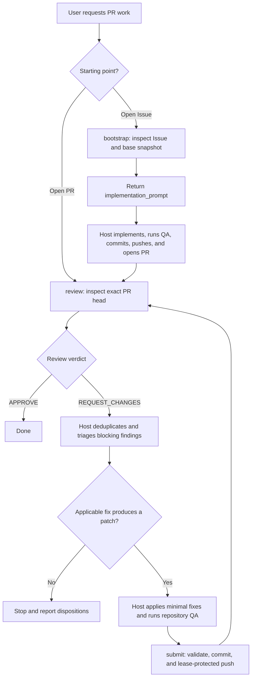

# pr-review-loop

`pr-review-loop` is a vendor-neutral agent skill for taking GitHub work through independent Oracle/ChatGPT review. It can start from an existing pull request or, optionally, from an open GitHub Issue.

The host agent is the primary interface: it owns planning, implementation, repository QA, and iteration. The skill provides deterministic Issue/Git/GitHub inspection, review transport, and guarded submission.

## How it works



The loop stops on approval, operational failure, the chosen iteration limit, or when triage finds no applicable fix. It never manufactures approval or re-reviews an unchanged head.

### Responsibility split

- **Host agent:** planning, triage, implementation, repository QA, iteration, and opening the initial PR for Issue-started work.
- **Oracle/ChatGPT:** independent review of the exact pull-request head.
- **`bootstrap`, `review`, `submit`:** deterministic command primitives for bounded inspection, review publication, validation, commit creation, and guarded push.

The commands are internal machine interfaces for the skill. Users normally interact with a compatible host agent rather than invoking the Python CLI directly.

## Agent usage

Compatible hosts discover this skill from user intent; the user does not need to name `pr-review-loop` or invoke its scripts directly.

Typical requests include:

- review an open pull request and resolve blocking findings until approval;
- fix or finalize an existing pull request;
- implement an open Issue, create its pull request, and carry that pull request through independent review.

## Discovery

The canonical skill lives at `skills/pr-review-loop/`.

- Codex CLI and Cursor CLI: `.agents/skills/pr-review-loop`
- Claude Code: `.claude/skills/pr-review-loop`

All discovery paths point to the same implementation. See `skills/pr-review-loop/SKILL.md` for the host-agent activation policy and workflow contract.

## Requirements

- macOS or Linux;
- Python 3.12+;
- Git and authenticated GitHub CLI;
- Oracle with Chrome/Chromium and an authenticated browser profile for `bootstrap` and `review`;
- push access and Git commit identity when running `submit`.

Additional repository constraints:

- Issue-started work requires an open, same-repository GitHub Issue and matching `origin`;
- PR review requires an open, non-draft, same-repository GitHub.com pull request and matching `origin`;
- GitHub Enterprise and fork PRs/Issues are unsupported.

Initialize Oracle once when needed:

```console
oracle --engine browser --browser-manual-login --browser-keep-browser \
  --browser-input-timeout 120000 --prompt "Reply with ready"
```

## Internal command interface

Start from an Issue:

```console
python3 skills/pr-review-loop/scripts/cli.py bootstrap --issue <NUMBER_OR_URL>
```

`bootstrap` requires an open, same-repository GitHub Issue and Oracle with an authenticated browser profile.

Review the exact PR head with the ordinary authenticated `gh` session:

```console
python3 skills/pr-review-loop/scripts/cli.py review --pr <NUMBER_OR_URL>
```

`review` requires an open, non-draft, same-repository GitHub.com PR, exact base/head binding, Oracle with an authenticated browser profile, and the repository permissions needed to publish a pull-request review. Oracle/ChatGPT supplies the independent `APPROVE` or `REQUEST_CHANGES` verdict; the authenticated GitHub user publishes a commit-anchored comment for self-authored PRs and the corresponding formal event otherwise, so self-authored PRs work without a second account. The command's structured `verdict` field is authoritative and does not depend on GitHub's formal review state.

Submit the host's complete patch against the reviewed head:

```console
python3 skills/pr-review-loop/scripts/cli.py submit \
  --pr <NUMBER_OR_URL> \
  --expected-head <REVIEWED_HEAD_SHA>
```

`submit` validates repository identity, exact local/remote head binding, conflicts, whitespace, staged content, credentials, repeated PR snapshots, and the remote branch lease. It creates one hook-free unsigned commit, pushes only with an explicit force-with-lease, and confirms the resulting GitHub PR head.

## Contracts and limits

All commands emit exactly one JSON object on stdout; diagnostics go to stderr. Operational failures return a non-zero status with a structured error object. Oracle-only files use private command-scoped temporary storage and are removed before the command completes.

CI status is not an approval gate. Production code must not launch, select, or detect Codex CLI, Claude Code, Cursor CLI, or another implementation agent.

See:

- `skills/pr-review-loop/references/command-contracts.md` for JSON schemas and exit classes;
- `skills/pr-review-loop/references/operations.md` for the compact cross-client smoke-test and recovery procedure.

## Development

```console
uv sync --dev
uv run pytest
uv run ruff check skills/pr-review-loop
uv run ruff format --check skills/pr-review-loop
uv run pyright
```
