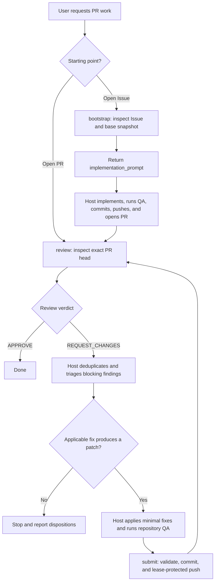

# pr-review-loop

`pr-review-loop` is a vendor-neutral agent skill for taking GitHub work through independent Oracle/ChatGPT review. It can start from an existing pull request or, optionally, from an open GitHub Issue.

The host agent is the primary interface: it owns planning, implementation, repository QA, and iteration. The skill provides deterministic Issue/Git/GitHub inspection, review transport, and guarded submission.

## How it works



The loop stops on approval, operational failure, the chosen iteration limit, or when triage finds no applicable fix. It never manufactures approval or re-reviews an unchanged head.

### Responsibility split

- **Host agent:** planning, triage, implementation, repository QA, iteration, and opening the initial PR for Issue-started work.
- **Oracle/ChatGPT:** independent review of the exact pull-request head.
- **`bootstrap`, `review`, `submit`:** deterministic command primitives for bounded inspection, review publication, validation, commit creation, and guarded push.

The commands are internal machine interfaces for the skill. Users normally interact with a compatible host agent rather than invoking the Python CLI directly.

## Agent usage

Compatible hosts discover this skill from user intent; the user does not need to name `pr-review-loop` or invoke its scripts directly.

Typical requests include:

- review an open pull request and resolve blocking findings until approval;
- fix or finalize an existing pull request;
- implement an open Issue, create its pull request, and carry that pull request through independent review.

## Discovery

The canonical skill lives at `skills/pr-review-loop/`.

- Codex CLI and Cursor CLI: `.agents/skills/pr-review-loop`
- Claude Code: `.claude/skills/pr-review-loop`

All discovery paths point to the same implementation. See `skills/pr-review-loop/SKILL.md` for the host-agent activation policy and workflow contract.

## Requirements

- macOS or Linux;
- Python 3.12+;
- Git and authenticated GitHub CLI;
- Oracle with Chrome/Chromium and an authenticated browser profile for `bootstrap` and `review`;
- `GH_REVIEW_TOKEN` for a dedicated reviewer account distinct from the PR author when running `review`;
- push access and Git commit identity when running `submit`.

Additional repository constraints:

- Issue-started work requires an open, same-repository GitHub Issue and matching `origin`;
- PR review requires an open, non-draft, same-repository GitHub.com pull request and matching `origin`;
- GitHub Enterprise and fork PRs/Issues are unsupported.

Initialize Oracle once when needed:

```console
oracle --engine browser --browser-manual-login --browser-keep-browser \
  --browser-input-timeout 120000 --prompt "Reply with ready"
```

## Workflow details

### Start from an Issue

`bootstrap` reads one open Issue and asks Oracle/ChatGPT to turn the Issue plus bounded repository evidence into an implementation-ready prompt. The result is bound to the Issue and an exact default-branch commit snapshot.

Before `bootstrap`, the host must use a clean local branch at the current default-branch tip and ensure `.pr-review-loop/` (or the `--artifacts-dir` override) is excluded from ordinary Git staging, for example through `.git/info/exclude`. `bootstrap` fails closed if the workspace is dirty, the local `HEAD` differs from the bound `base_sha`, or the artifact directory could be staged accidentally.

The host then validates the returned prompt against the bound repository/base metadata, implements the change, runs repository QA, commits, pushes, and opens a PR. `bootstrap` never edits files, implements the Issue, commits, pushes, or creates a PR.

Once the PR exists, Issue-specific state is no longer needed; the normal PR review loop takes over.

### Review and improve a PR

1. Run `review` against the exact current PR head.
2. Finish on `APPROVE`.
3. On `REQUEST_CHANGES`, deduplicate and triage each blocking finding against the reviewed head.
4. Classify each distinct finding as `fix`, `already_addressed`, `outdated`, `clarify`, or `defer`.
5. Apply only `fix` findings, keeping edits minimal and scoped, then run normal repository QA.
6. Run `submit` only if triage produced a real workspace patch.
7. Run a fresh `review` on the new head and repeat as needed.

If triage produces no `fix` disposition, stop rather than submitting or re-reviewing an unchanged head. Report the dispositions and leave any still-open `REQUEST_CHANGES` review for the user or a maintainer to dismiss or override.

## Internal command interface

Start from an Issue:

```console
python3 skills/pr-review-loop/scripts/cli.py bootstrap --issue <NUMBER_OR_URL>
```

`bootstrap` requires an open, same-repository GitHub Issue and Oracle with an authenticated browser profile. It does not require `GH_REVIEW_TOKEN`.

Review the exact PR head:

```console
export GH_REVIEW_TOKEN='...'
python3 skills/pr-review-loop/scripts/cli.py review --pr <NUMBER_OR_URL>
```

`review` requires an open, non-draft, same-repository GitHub.com PR, exact base/head binding, Oracle with an authenticated browser profile, and a dedicated reviewer account different from the PR author.

Submit the host's complete patch against the reviewed head:

```console
python3 skills/pr-review-loop/scripts/cli.py submit \
  --pr <NUMBER_OR_URL> \
  --expected-head <REVIEWED_HEAD_SHA>
```

`submit` validates repository identity, exact local/remote head binding, conflicts, whitespace, staged content, credentials, repeated PR snapshots, and the remote branch lease. It creates one hook-free unsigned commit, pushes only with an explicit force-with-lease, and confirms the resulting GitHub PR head.

## Contracts and limits

All commands emit exactly one JSON object on stdout; diagnostics go to stderr. Operational failures return a non-zero status with a structured error object. Private audit artifacts are written below `.pr-review-loop/runs/` by default.

CI status is not an approval gate. Production code must not launch, select, or detect Codex CLI, Claude Code, Cursor CLI, or another implementation agent.

See:

- `skills/pr-review-loop/references/command-contracts.md` for JSON schemas and exit classes;
- `skills/pr-review-loop/references/operations.md` for the compact cross-client smoke-test and recovery procedure.

## Development

```console
uv sync --dev
uv run pytest
uv run ruff check skills/pr-review-loop
uv run ruff format --check skills/pr-review-loop
uv run pyright
```
