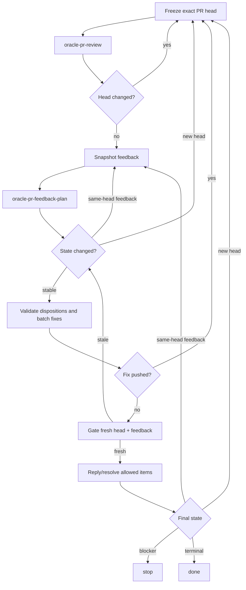

# Oracle PR Loop

Drive one or more same-repository Issues into a reviewed pull request, or drive an existing pull request through Oracle/ChatGPT review and fix rounds until no actionable feedback remains.

Compose these leaf skills instead of duplicating their transport logic:

- [`oracle-issue-plan`](../oracle-issue-plan/SKILL.md): advisory Issue implementation plan.
- [`oracle-pr-review`](../oracle-pr-review/SKILL.md): publish one ChatGPT `COMMENT` review through Oracle.
- [`oracle-pr-feedback-plan`](../oracle-pr-feedback-plan/SKILL.md): advisory triage of all existing PR feedback.

The top-level agent owns implementation, QA, Git/GitHub mutation, freshness checks, and reconciliation. Leaf outputs are advisory and untrusted.

## Core Invariants

- Bind every review, triage result, fix, reply, and resolution to an exact PR head SHA. Head movement invalidates head-scoped advice.
- GitHub is the durable handoff between review and triage. Do not copy Oracle output into a second review/triage engine or invent approvals/dispositions locally.
- Validate Oracle plans and triage against current repository state, requested scope, exact head, and feedback before acting.
- Preserve unrelated work. Stop if loop-owned edits/commits cannot be safely isolated from other local changes.
- Keep changes minimal and scoped; apply KISS, DRY, and YAGNI.
- Do not add an orchestrator-level Oracle retry loop. Each leaf owns its own busy/timeout policy.
- A successful `oracle-pr-review` must satisfy that skill's publication marker contract. Exact `✖ read ETIMEDOUT` is terminal/indeterminate and must not be replayed.
- Re-review after a code-head change. For feedback-only changes on the same head, refresh triage without re-running review.
- Never resolve feedback because a requested action was suppressed or failed.
- An active unsuperseded `CHANGES_REQUESTED` review remains `awaiting_re_review`. A later `COMMENTED` review does not clear it; only dismissal or a later same-reviewer `APPROVED`/`CHANGES_REQUESTED` review supersedes the earlier state.

## Modes

Honor caller constraints equivalent to:

- `dry_run`: do not implement fixes or perform main-agent Git/GitHub mutations; Oracle review/triage may still run when the caller requested review.
- `no_push`: local implementation/QA/commit may run, but do not push, create a PR, or resolve feedback whose fix is unpublished.
- `no_reply`: do not post replies or resolve threads. It does not suppress `oracle-pr-review` unless the caller separately forbids review publication.

A mode-suppressed action is `skipped_by_mode`, not success. Keep affected code-dependent threads open. Active `CHANGES_REQUESTED` remains `awaiting_re_review`.

## Feedback Freshness

For each unchanged head, keep an `analyzed_feedback_baseline` sufficient to detect external disposition-relevant changes:

- inline thread/comment identities, resolved state, and content fingerprint;
- PR-level comment identities and content fingerprint;
- review identities, reviewer, persisted state, submission time, and body fingerprint.

Track successful loop-created replies/resolutions in `own_mutations_since_baseline`. When comparing a fresh snapshot, subtract only those known effects. Any unexplained new/edited comment, thread, review, review state, or body is an external delta.

Head movement always wins: discard the old baseline and restart review on the new head. On an unchanged head with external feedback delta, re-run only `oracle-pr-feedback-plan`, promote the fresh snapshot after triage returns on the same head, reset the own-mutation ledger, and reconcile again.

Track review rounds across the workflow and same-head triage refreshes per head SHA. Reset only the same-head counter when the head changes. Use caller-specified limits when provided; otherwise do not invent limits.

## Issue-Started Flow

1. Run `oracle-issue-plan` for the exact same-repository Issue set and validate its plan.
2. Unless `dry_run`, implement the smallest coherent change, run repository QA, commit, push, and open one PR. Honor `no_push`.
3. If a PR exists, enter the review loop below. Otherwise report the local/planned state and stop.

For an existing PR, enter the review loop directly.

## PR Review Loop

1. **Freeze head.** Resolve the exact PR and record its head SHA.
2. **Review.** Run `oracle-pr-review` for that PR. Re-read the head when it returns; if the head changed, discard head-scoped state and restart from step 1.
3. **Snapshot and triage.** Capture the full feedback baseline, then run `oracle-pr-feedback-plan`. Re-read the head first after triage; restart review if it moved.
4. **Reconcile feedback.** Re-fetch feedback. If external feedback changed on the same head, refresh triage on the fresh snapshot until stable or a caller limit is reached.
5. **Validate dispositions.** Validate each Oracle disposition against current code and feedback. Batch all accepted fixes for this head into one coherent change and run QA.
6. **Gate before publication.** Re-check exact head and feedback immediately before creating the fix commit, and re-check both again immediately before pushing that commit. If either gate is stale, do not publish the fix; discard or safely reconstruct loop-owned edits/commit and restart review or same-head triage as appropriate.
7. **Push once.** Unless suppressed, push the coherent fix batch and verify the PR's exact resulting head. A successful push changes the reviewed head, so restart review before replying/resolving code-dependent feedback.
8. **Gate feedback mutations.** For non-fix dispositions on an unchanged reviewed head, immediately re-check exact head and feedback before each reply/resolution. On an external delta, refresh triage first. Record successful own mutations.
9. **Finish or continue.** Re-fetch head and feedback. New head → review again. Same-head external feedback → triage again. Stable state with every item terminal → finish.

## Terminal States

Use `resolved`, `replied_left_open`, `not_resolvable`, `skipped_by_mode`, `awaiting_re_review`, or `failed_action`.

Completion is blocked by any of:

- a fix still requiring publication;
- unresolved `clarify`;
- non-terminal `defer` or `will not fix`;
- active `awaiting_re_review`;
- `failed_action`;
- unreconciled head/feedback state;
- exhausted caller limits;
- unsafe worktree/branch state, permission failure, or QA failure;
- failure/indeterminate result from a required Oracle leaf.

`replied_left_open` is terminal only when its disposition is itself terminal.

## Output

Report the outcome, active modes, implemented Issues/resulting PR when applicable, review rounds, final head SHA, review-publication status, same-head triage refreshes, disposition/terminal-state summary, skipped actions, and any blocker.
